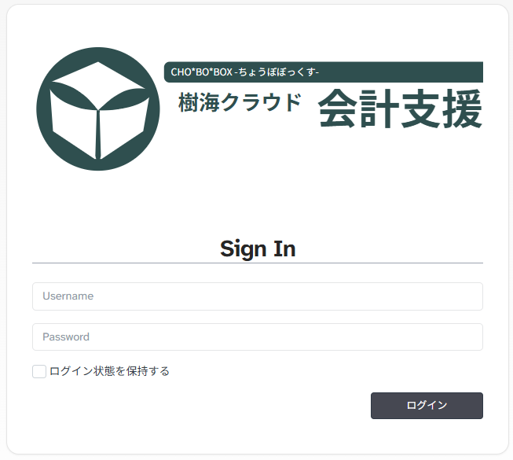
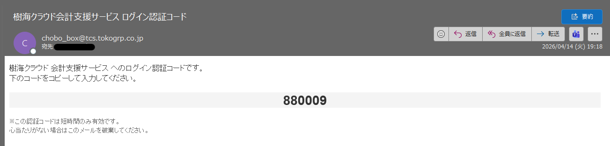
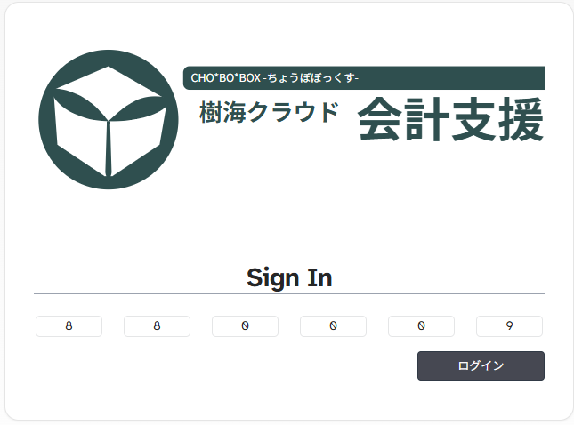

# ログイン手順

このシステムの通常ログインは、`ユーザーID + パスワード` による認証のあと、メールで受け取る OTP を入力する 2 段階方式です。

## ログイン前に準備するもの

- サブドメイン付きのURL
- ユーザーID
- パスワード
- OTP を受信できるメールアドレス

## 手順

1. ログイン画面を開きます。
2. `Username` にユーザーIDを入力します。
3. `Password` にパスワードを入力します。
4. ログインボタンを押します。
5. 登録メールアドレス宛に OTP が送信されます。
6. OTP 入力画面で、受信したコードを入力（コピー&ペースト）します。
7. 認証が成功すると、対象会社のホーム画面に移動します。

## メール認証

## ログインできないときの確認ポイント

- ユーザーIDとパスワードが正しいか
- OTP メールが迷惑メールに入っていないか
- メールアドレスが最新か

## ユーザーID、パスワードが分からない場合

管理者権限を持つ社内ユーザーに連絡して、管理者設定にて確認、及びにパスワードの再発行を行ってください。
