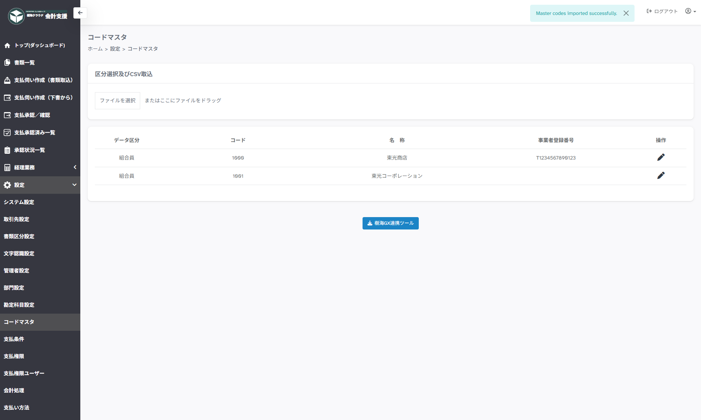

---
tags:
  - 設定
  - 管理者
  - 連携
---

# 設定 > コードマスタ

## ■ 概要

コードマスタ：補助科目（CSV形式）の取り込みを行うページです。

## ■ 説明

- **CSV取込み**　…　補助科目データが設定されたCSVファイルを選択してください

- **操作「鉛筆マーク」**　…　取り込んだデータを編集します

- **樹海GX連携ツール**　…　樹海GX連携ツールをダウンロードします

## ■ CSVデータ項目内容

| 列番号 | タイトル名 | 説明 |
| --- | --- | --- |
| 1 | データ区分 | 1：組合員、2：補助科目、3：支所、4：取引先、6：事業現場 |
| 2 | コード | システムコード |
| 3 | 名称 | 正式名称 |

!!! warning "注意事項"

    タイトル行必須になります。