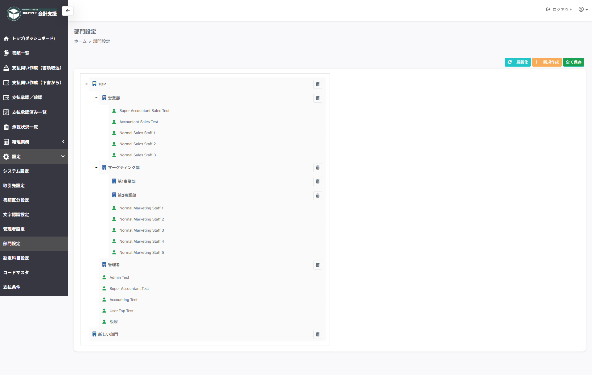

# 設定 > 部門設定

## ■ 概要

部門の設定ページです。

## ■ 注意事項
!!! warning "保存について"
    **全て保存**をクリックし忘れると保存されません。

## ■ 説明

- **最新化**　…　ページを更新します。

- **新規作成**　…　一覧に「新しい部門」として部門を作成します。

- **全て保存**　…　設定内容を登録します。

## ■ 部門名の設定方法

一覧の部門名をダブルクリックすることで入力可能となります。