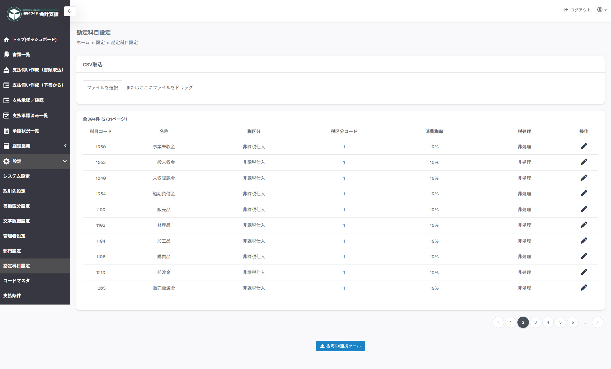

---
tags:
  - 設定
  - 管理者
  - 連携
---

# 設定 > 勘定科目設定

## ■ 概要

勘定科目情報（CSV形式）の取り込みを行うページです。

## ■ 説明

- **CSV取込み**　…　勘定科目データが設定されたCSVファイルを選択してください

- **操作「鉛筆マーク」**　…　取り込んだデータを編集します

- **樹海GX連携ツール**　…　樹海GX連携ツールをダウンロードします

## ■ CSVデータ項目内容

| 列番号 | タイトル名 | 説明 |
| --- | --- | --- |
| 1 | 科目コード | 勘定科目システムコード |
| 2 | 科目名称 | 勘定科目正式名称 |
| 3 | 税処理名称 | 右記から選択： 非処理、税抜別段、税抜自動、税込自動 |
| 4 | 貸借区分 | 1：借方、2：貸方 |
| 5 | 借方－税区分コード | 借方時の税区分システムコード |
| 6 | 借方－税区分名称 | 税区分正式名称 |
| 7 | 貸方－税区分コード | 貸方時の税区分システムコード |
| 8 | 貸方－税区分名称 | 税区分正式名称 |

!!! warning "注意事項"

    タイトル行必須になります。