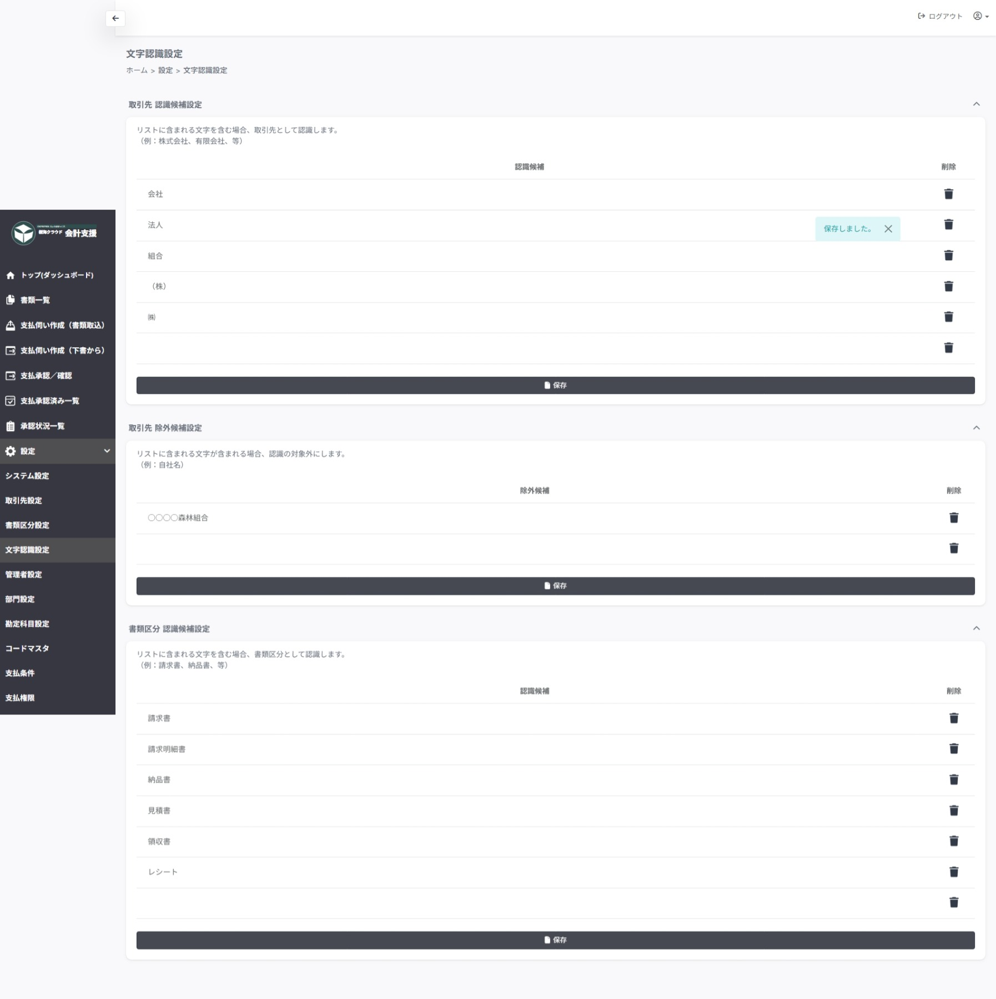

# 設定 > 文字認識設定

## ■ 概要

書類取込時のOCR精度を向上させるための設定ページです。

## ■ 注意事項
!!! warning "保存について"
    保存は各設定ごとに行います。
    保存後ページの再読込をするため、他の設定項目は初期化されます。
    各設定項目ごとに保存を行ってください。

## ■ 説明

### 取引先 認識候補設定

取引先として、識別できる文字列を登録します。

!!! info "設定例"
    株式会社、森林組合、など

### 取引先 除外候補設定

取引先として、識別させない文字列を登録します。

!!! info "設定例"
    自社名 など

### 書類区分 認識候補設定

書類のタイトルとして、識別できる文字列を登録します。

!!! info "設定例"
    請求書、領収書、レシート など