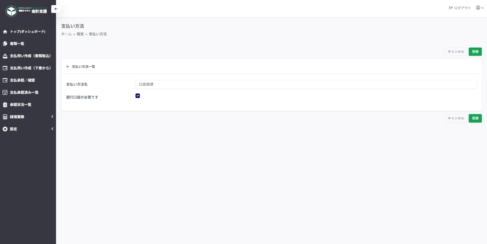
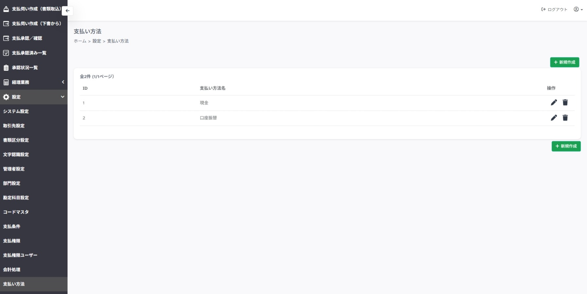

---
tags:
  - 設定
  - 管理者
  - 経理業務
---

# 設定 > 支払い方法

## ■ 概要

支払い方法の設定ページです。

## ■ 操作

- **＋新規作成**　…　支払い方法新規作成ページを開きます

- **操作「鉛筆マーク」**　…　支払い方法情報編集ページを開きます

- **操作「ゴミ箱マーク」**　…　支払い方法の削除を確認します

## ■ 説明

- **支払い方法名**　…　現金、口座振替など任意の名称を入力します

- **銀行口座が必要です**　…　口座振込の場合はチェックします