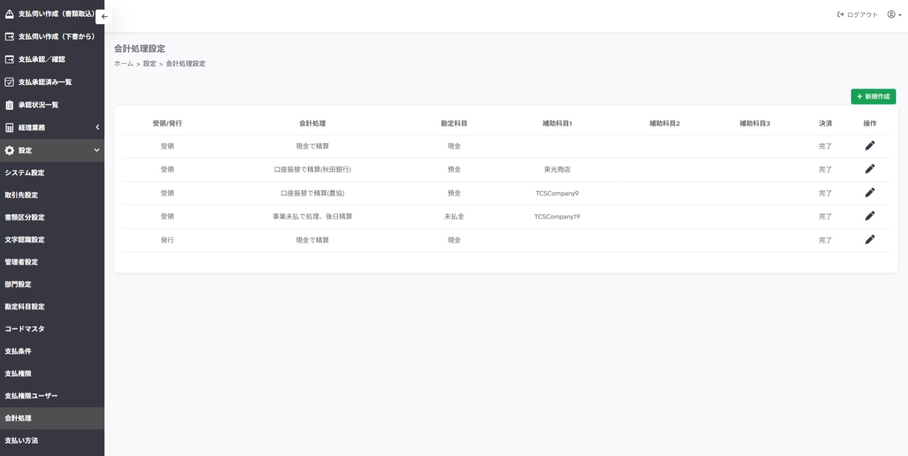
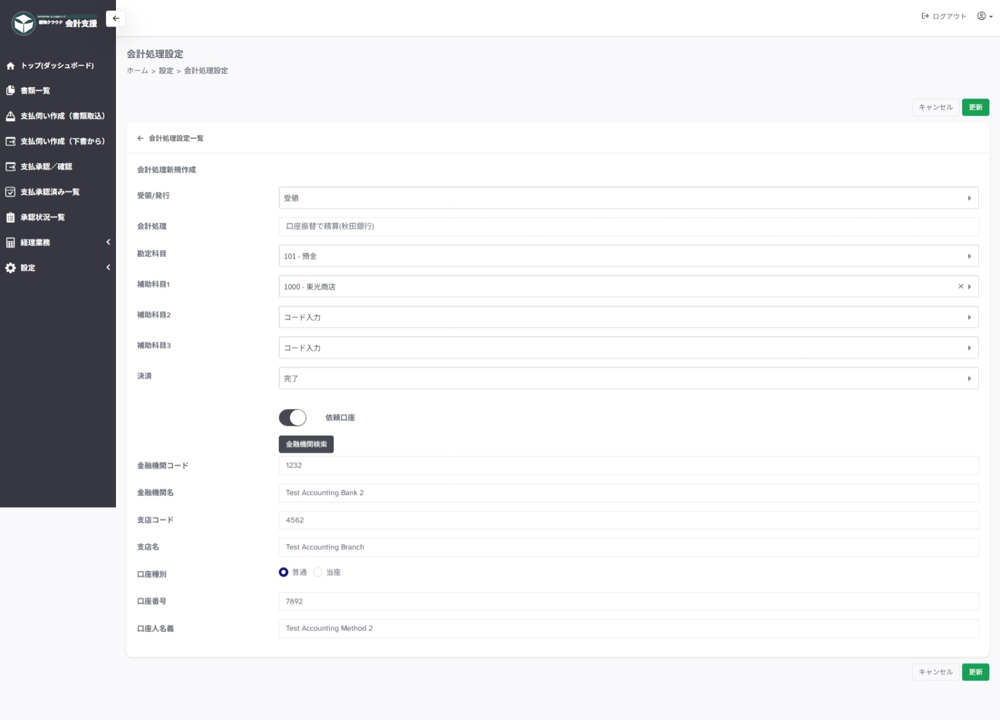

---
tags:
  - 設定
  - 管理者
  - 経理業務
---

# 設定 > 会計処理

## ■ 概要

経理業務において、支払方法にあたる仕訳設定を行うページです。

## ■ 操作

- **＋新規作成**　…　会計処理新規作成ページを開きます

- **操作「鉛筆マーク」**　…　会計処理情報編集ページを開きます

## ■ 説明

- **受領/発行** … 受領（仕入）/発行（売上）を選択します

- **会計処理** … 支払方法を選択します

- **勘定科目** … 勘定科目を選択します（現金、預金など）

- **補助科目** … 必要に応じて補助科目1～3つ選択します

    - `@取引先`を指定すると、申請時の取引先が自動で設定されます
    
- **決裁** … 現金や預金で即時支払いの場合は`完了`、未払金などを利用する場合は`未完了`を選択します

- **依頼口座** … 口座振替で支払いの場合、トグルボタンをONにし、金融機関情報を入力します

    - 口座振替FD作成にて使用されます