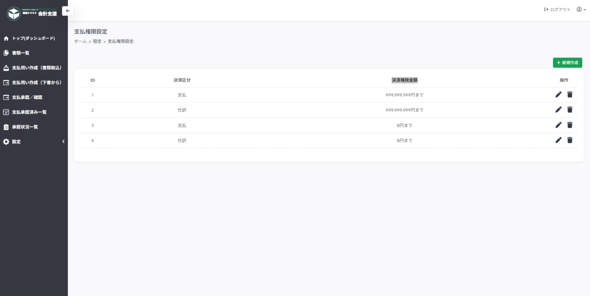

---
tags:
  - 設定
  - 管理者
---

# 設定 > 支払権限

## ■ 概要

支払承認／仕訳確定における承認上限金額の設定ページです。

## ■ 操作

- **＋新規作成**　…　支払権限新規作成ページを開きます

- **操作「鉛筆マーク」**　…　支払権限情報編集ページを開きます

- **操作「ゴミ箱マーク」**　…　支払権限の削除を確認します

## ■ 説明

承認上限金額のパターンごとに登録を行います。
ユーザーとの紐付けは別ページを参照（ [支払権限ユーザー](role_user_setting.md)

**決裁区分**

- 決裁区分が `支払` の場合、支払承認に利用
- 決裁区分が `仕訳` の場合、仕訳確定に利用

**決裁権限金額**

- 登録した金額以下の承認が可能
- 登録した金額より大きい金額は承認できず確認者になります

!!! info "設定例"

    - 課長は、支払承認を 500,000 まで承認できるが、仕訳確定はできない
        - 決裁区分：支払、決裁権限金額 500,000
        - 決裁区分：仕訳、決裁権限金額 0
        
    - 組合長は、支払承認と仕訳確定を 全て承認できる
        - 決裁区分：支払、決裁権限金額 999,999,999
        - 決裁区分：仕訳、決裁権限金額 999,999,999