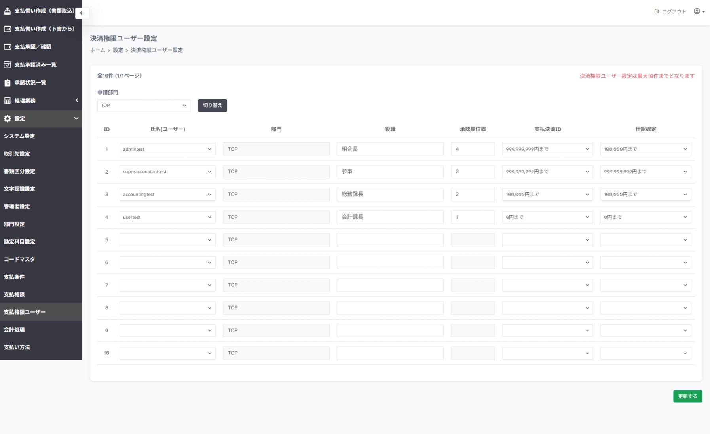

---
tags:
  - 設定
  - 管理者
---

# 設定 > 支払権限ユーザー

## ■ 概要

支払権限とユーザー情報を紐付け登録するページです。

## ■ 操作

- **申請部門 切り替え**　…　部門ごとの決裁権限ユーザーを確認します

- **更新する**　…　決裁権限ユーザーを登録します

## ■ 説明

- 氏名（ユーザー）　…　ユーザーIDを指定します

- 役職　…　役職名を指定します 役職名は `支払伺い書`の承認印欄に表示されます

- 承認欄位置　…　1 ～ 10の間で数字が小さいほど左側に承認印欄が配置されます

- 支払決裁　…　支払申請において承認可能な金額を選択します

- 仕訳確定　…　支払申請において仕訳確定可能な金額を選択します