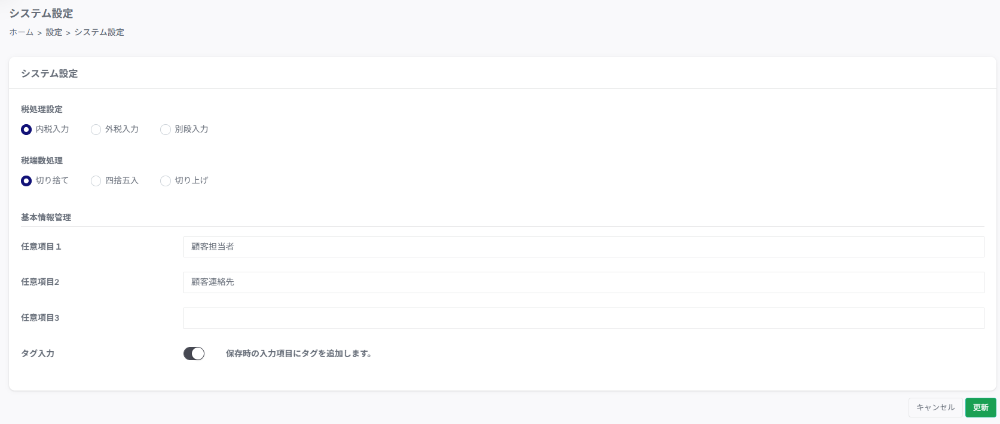
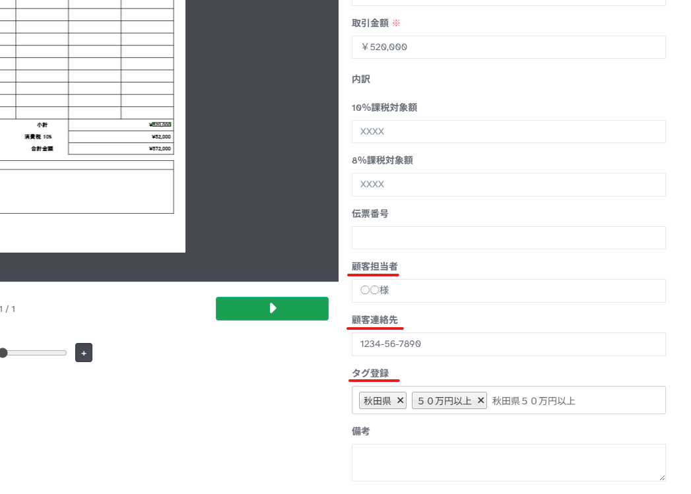

---
tags:
  - 初期設定
  - 設定
  - 管理者
---

# 設定 > システム設定

## ■ 概要

システム導入時に初回設定します。主に税計算関連を設定するページです。

## ■ 説明

### 税処理設定

- **内税入力**　…　金額を税込で入力します

- **外税入力**　…　金額を税抜で入力します

- **別段入力**　…　金額を税抜、消費税額を別行で入力します

### 税端数処理

- **切り捨て**　…　消費税の自動計算の際、端数分を切り捨てで算出します

- **四捨五入**　…　消費税の自動計算の際、端数分を四捨五入で算出します

- **切り上げ**　…　消費税の自動計算の際、端数分を切り上げで算出します

### 基本情報管理

- **任意項目１～３**

    取込書類の基本情報における任意の入力項目のタイトルを設定します

- **タグ入力**

    取込書類の基本情報にタグの登録の有無を設定します
  
!!! info "設定例"
  
