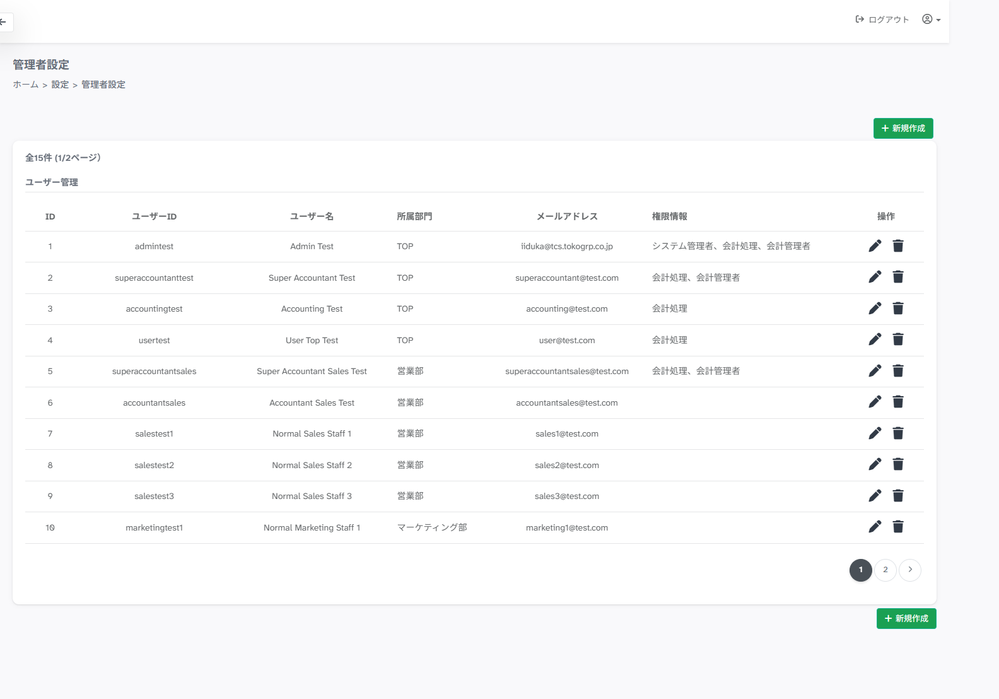
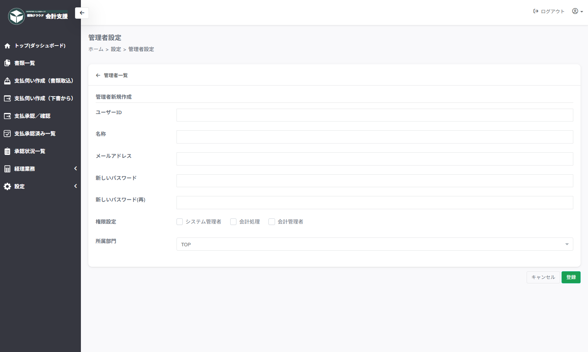
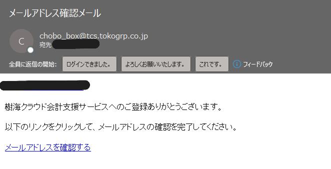
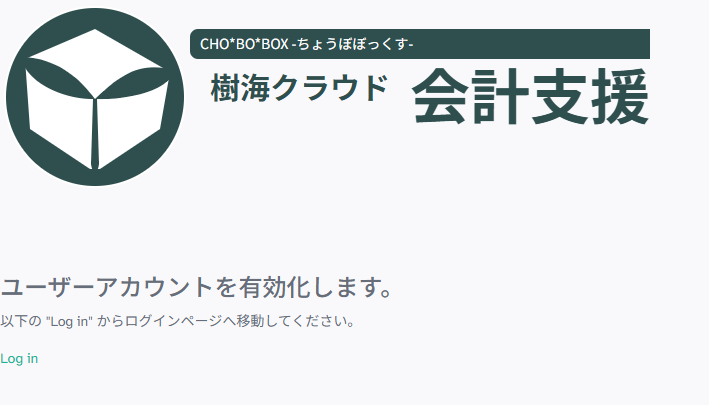
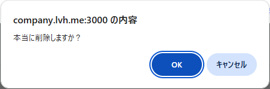

# 設定 > 管理者設定（ユーザー設定）

## ■ 概要

利用ユーザーを設定するページです。

## ■ 一覧 説明

- **＋新規作成**　…　ユーザー新規作成ページを開きます

- **操作「鉛筆マーク」**　…　ユーザー情報編集ページを開きます

- **操作「ゴミ箱マーク」**　…　ユーザーの削除を確認します

## ■ 新規作成ページ 説明

- **ユーザーID**　…　ログインIDを半角英数字で入力します。

- **名称**　…　利用ユーザー名を漢字氏名で入力します。

- **メールアドレス**　…　メールアドレスを入力します。

- **新しいパスワード**　…　パスワードを６桁以上で入力します。

- **新しいパスワード(再)**　…　上記と同じパスワードを入力します。

- **権限設定**　…　付与する権限を選択します。

    ??? note "権限について <クリックで開く>"

        | 権限 | 主な条件 | できること |
        | --- | --- | --- |
        | 権限無し | ユーザー登録済み | ログイン、証憑登録、申請、プロフィール変更 |
        | システム管理者 | システム管理者権限あり | 設定メニュー、ユーザー管理、各種マスタ管理 |
        | 会計処理 | 会計処理権限あり | 経理メニュー参照、対象機能利用 |
        | 会計管理者 | 会計管理者権限あり | 経理承認済みデータへの強い編集権限を持つ |

- **所属部門**　…　所属部門を選択します。

!!! warning "登録アドレスへメールが送信されます。"
    
    ユーザー登録前に利用者へ事前連絡が必要になります。
    
    
    

## ■ 編集ページ 説明

パスワードは、変更なしの場合は空のままとしてください。

!!! warning "メールアドレス変更時にメールが送信されます。"
    
    

## ■ 削除 説明

一覧から**操作「ゴミ箱マーク」**をクリックして確認後、削除となります。

