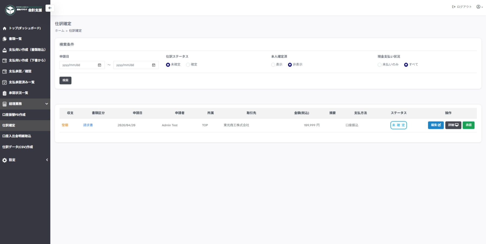

---
tags:
  - 仕訳確定
  - 経理業務
---

# 仕訳確定

申請情報の仕訳情報を承認するページです。

サイドメニューの`経理業務＞支払承認／確認`から移動します。
会計処理、会計管理者権限をもつユーザーのみがダウンロード可能です。

## 1. 支払管理

支払管理ページでは申請情報を状態別タブで確認します。

タブ一覧:

- 編集　…　仕訳内容を編集します。
- 詳細　…　仕訳内容をプレビューします。
- 承認　…　承認します。

!!! note "編集について"

    [支払伺い作成（書類取込）](document_entry.md)