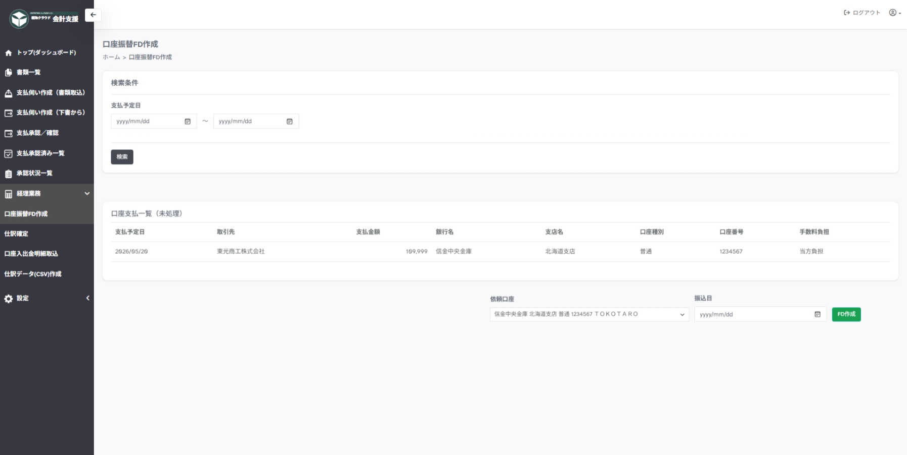

---
tags:
  - FD作成
  - 経理業務
---

# 口座振替ＦＤ作成

申請情報をもとに、口座振替ＦＤの作成／ダウンロードを実施するページです。

サイドメニューの`経理業務＞口座振替ＦＤ作成`から移動します。
会計処理、会計管理者権限をもつユーザーのみがダウンロード可能です。

## 検索

申請時に入力した申請予定日の範囲で検索します。

## FD作成

依頼口座と振込日を指定して、`FD作成`ボタンからダウンロードします。
一度ダウンロードしたデータは処理済となり一覧に表示されないためご注意ください。

> `FB出力[年月日時分秒].txt` が作成されます。