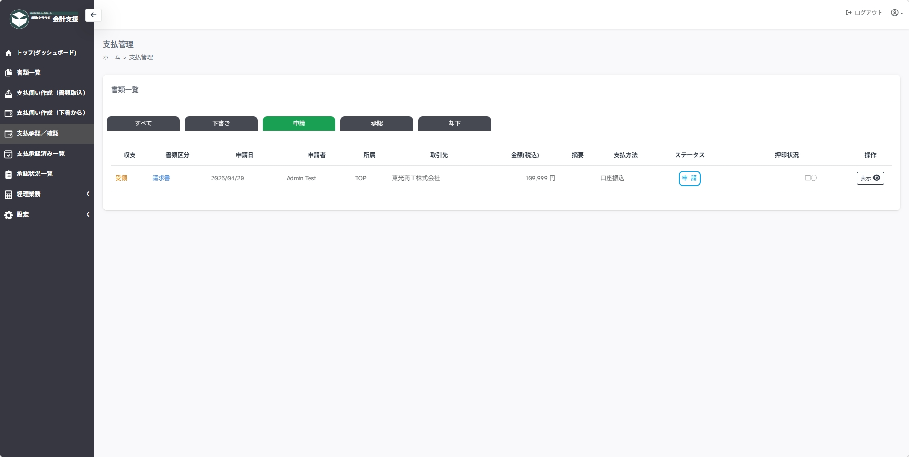
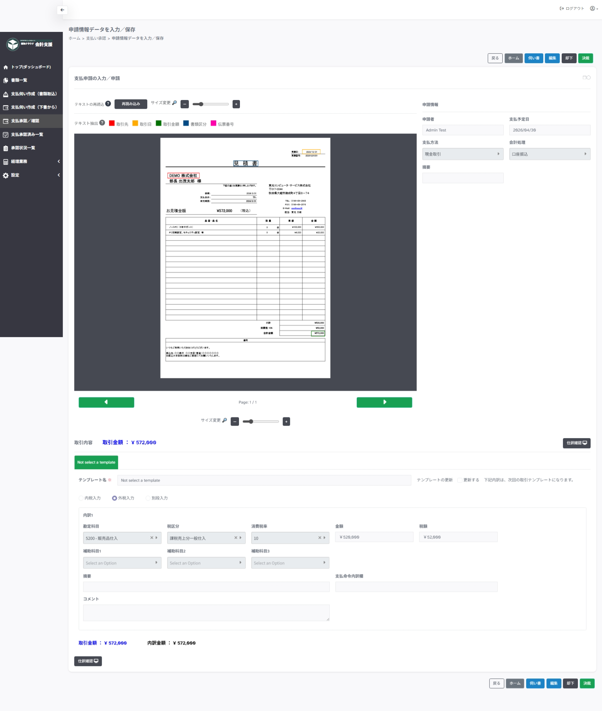

---
tags:
  - 承認／確認
  - 支払伺い
  - 書類取込
---

# 承認と却下

支払申請情報を承認するページです。

サイドメニューの`支払承認／確認`から移動します。
承認権限をもつユーザーのみが承認可能です。

## 1. 支払管理

支払管理ページでは申請情報を状態別タブで確認します。

タブ一覧:

- すべて
- 下書き
- 申請
- 承認
- 却下

操作:

確認する申請の`表示ボタン`をクリックして、申請情報確認ページへ移動します。

押印状況:

- □ … 自ユーザーが未承認、未確認の状態
- ■ … 自ユーザーが承認済み、確認済みの状態
- ○ … 他ユーザーが未承認、未確認の状態
- ● … 他ユーザーが承認済み、確認済みの状態

## 2. 申請情報確認

申請内容の支払情報と会計仕訳情報を確認します。

操作:

- 決裁 … 決裁（承認）済にします。
- 却下 … 却下コメントを記載し、差し戻します。
- 編集 … 必要に応じて修正します。
- 伺い書 … 伺い書をプレビューします。
- ホーム … `支払管理`ページへ戻ります。

!!! note "編集方法についてはこちら"

    [支払伺い作成（書類取込）](document_entry.md)