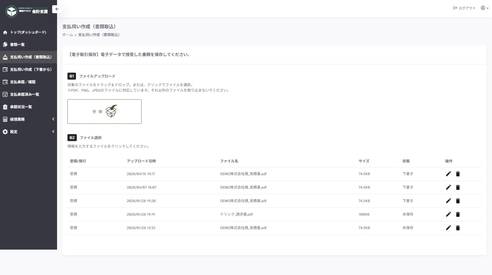
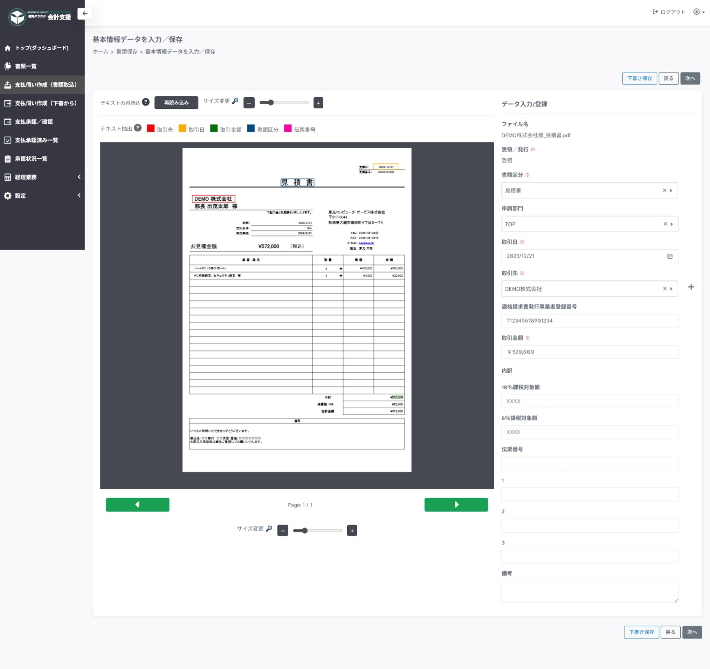
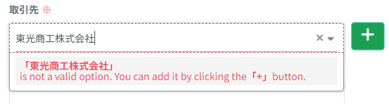
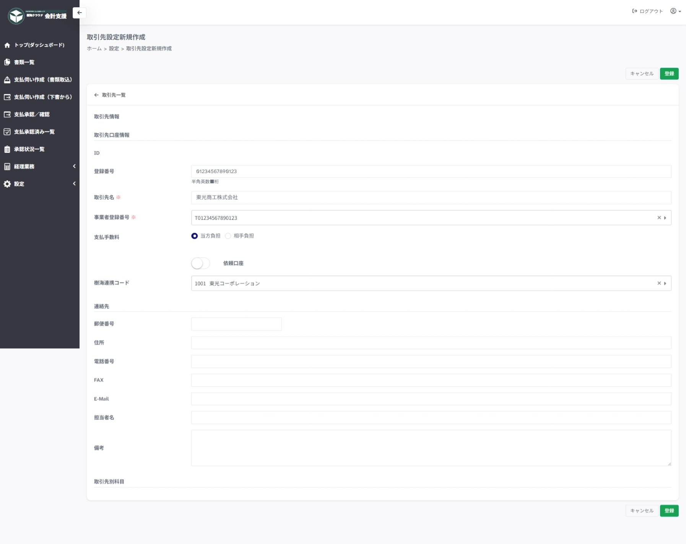
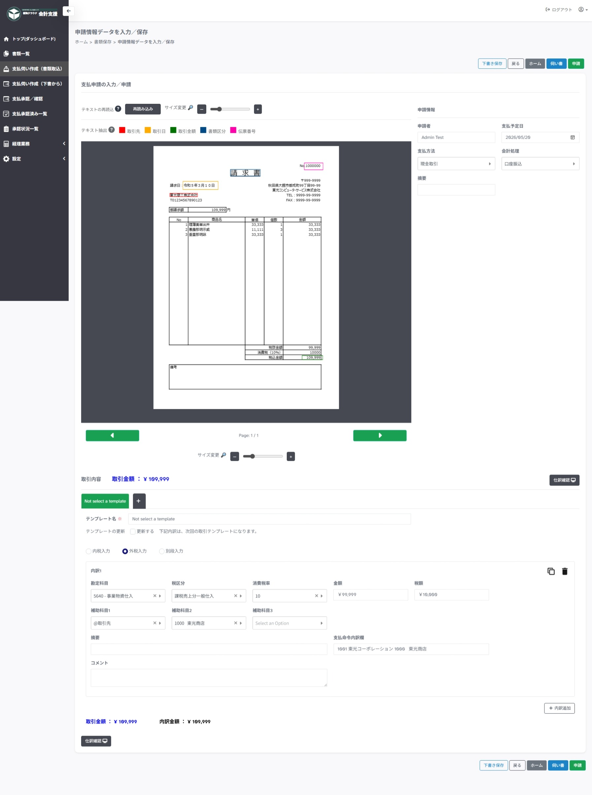
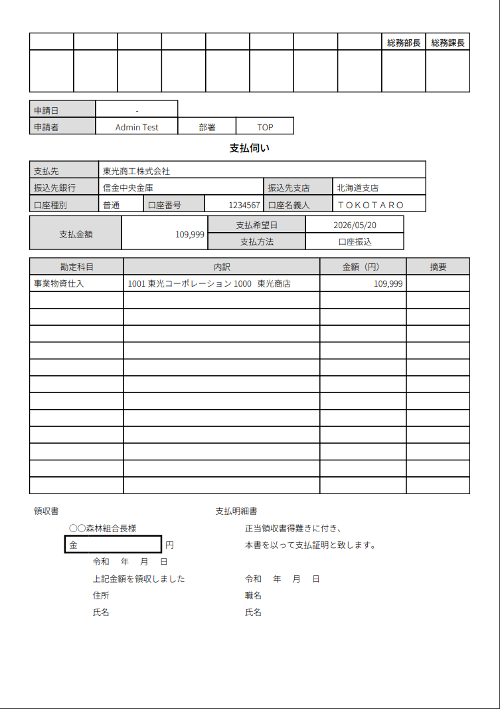
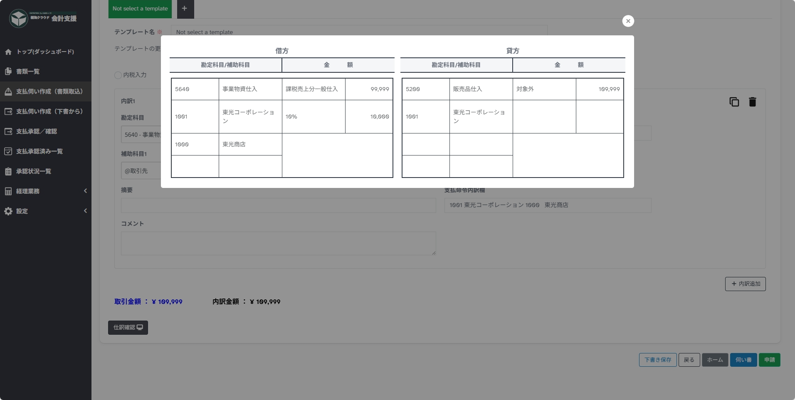
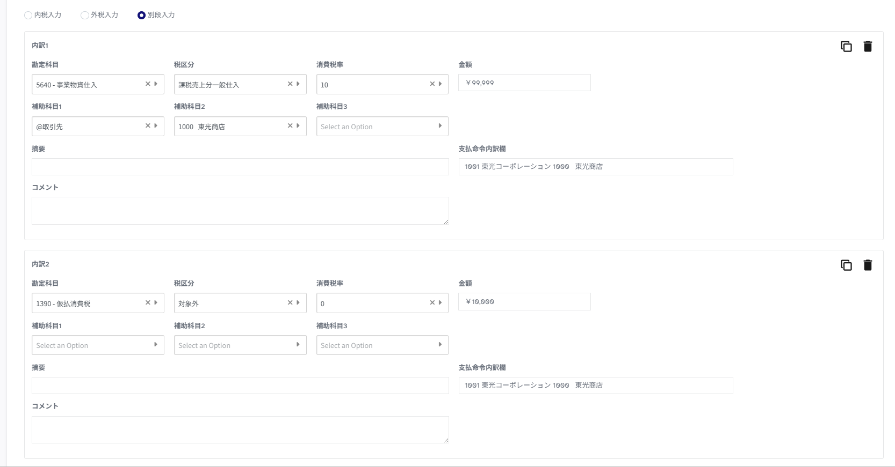

---
tags:
  - 申請
  - 支払伺い
  - 書類取込
---

# 支払伺い作成と申請

サイドメニューの`支払伺い作成（書類取込）`から申請します。

## 1. 書類取込

書類取込では、画像ファイル（PDF、PNG、JPEG）をサービスへ取り込みます。

1 ファイルアップロード -> クリックでファイルを選択、または、ドラッグ＆ドロップでファイルを取り込めます。

2 ファイル選択 -> 取り込んだファイルの一覧が表示されます。

    - 操作の「鉛筆マーク」で `2. 基本情報入力` を開始します。
    
    - 操作の「ごみ箱マーク」で削除します。

## 2. 基本情報入力

基本情報入力では、書類ファイルから読み取った内容を伝票として整理します。

**主な入力項目:**

- 書類区分
- 申請部門
- 取引日
- 取引先
- 適格請求書発行事業者登録番号
- 取引金額
- 内訳金額
    - 10%課税対象額
    - 8%課税対象額
- 伝票番号
- 備考

**`次へ`ボタン:**

`次へ`ボタンで`申請情報入力`にページを移動します。

**`下書き保存`ボタン:**

現在の状態で保存して入力を終了します。
状態が「下書き」になります。

??? note "文字認識（ OCR ）について <クリックで開く>"
    
    以下の項目を認識対象として読み込みます。
    
    - 書類区分
    - 取引日
    - 取引先
    - 取引金額
    - 伝票番号
    
    テキストの読み込みに成功した場合、プレビュ－のその箇所が枠線によって囲われます。
    うまく読み込めていない場合、対象の入力項目にカーソルを置いてプレビューをドラッグしてテキストを選択できます。

??? note "取引先の追加について <クリックで開く>"
    
    `取引先設定` に登録されていない取引先の場合、"＋"ボタンより取引先設定を別タブで開いて登録します。
    
    
    
    

## 3. 申請情報入力

申請情報入力では、支払と会計に必要な情報を登録します。

**主な入力項目:**

- 申請者
- 支払予定日
- 支払方法
    - 金融機関情報 ※口座振替の場合のみ
- 会計処理
- 税計算方法
- 会計内訳
    - 勘定科目
    - 税区分
    - 消費税率
    - 金額
    - 税額
    - 補助科目
    - 支払命令内訳欄
    - コメント
    
**`伺い書`ボタン:**

伺い書ＰＤＦをプレビューします。

??? note "伺い書イメージ <クリックで開く>"
    
    
    
**`戻る`ボタン:**

`基本情報入力`にページを移動します。

**`下書き保存`ボタン:**

現在の状態で保存して入力を終了します。
状態が「下書き」になります。

**`ホーム`ボタン:**

`書類取込`にページを移動します。

**`申請`ボタン:**

申請を行います。
状態が「申請中」になります。

**`仕訳確認`ボタン:**

実際の仕訳プレビューを表示します。

??? note "仕訳確認イメージ <クリックで開く>"
    
    

**`内訳追加`ボタン:**

仕訳の内訳が複数行ある場合に、仕訳行を追加できます。
主に消費税を別段で起こす、複数の税率がある場合などに利用します。

## 仕訳入力の考え方

!!! note "仕訳入力"

    仕訳の入力については、経理の業務となります。
    申請者は、`コメント`欄にて、どのような支払かを記載して申請します。
    その後、経理担当が内容を確認して編集、保存を行います。

## 税計算方法別の入力例

- 内税入力　…　`金額欄`を税込で入力します。
- 外税入力　…　`金額欄`を税抜で入力します。
- 別段入力　…　`金額欄`を税抜、`税額`を0円で入力し、`内訳追加`から消費税用の明細を作成します。

??? note "別段入力イメージ <クリックで開く>"
    
    

## テンプレートについて

**テンプレートの追加：**

`会計処理`で設定した仕訳とは別に、特定の取引先の場合に仕訳の入力の仕方を変更するなど、利用頻度は少ないが仕訳のパターンを変更したい場合に利用します。
頻度が多く、勘定科目や補助科目を変更する場合は、`会計処理`を設定から追加することをお勧めします。

**外税入力（税抜別段）の場合：**

別段で消費税を追加する場合、毎回入力が必要になってしまうため、初回はテンプレートの更新に☑チェックを入れて申請することをお勧めします。
