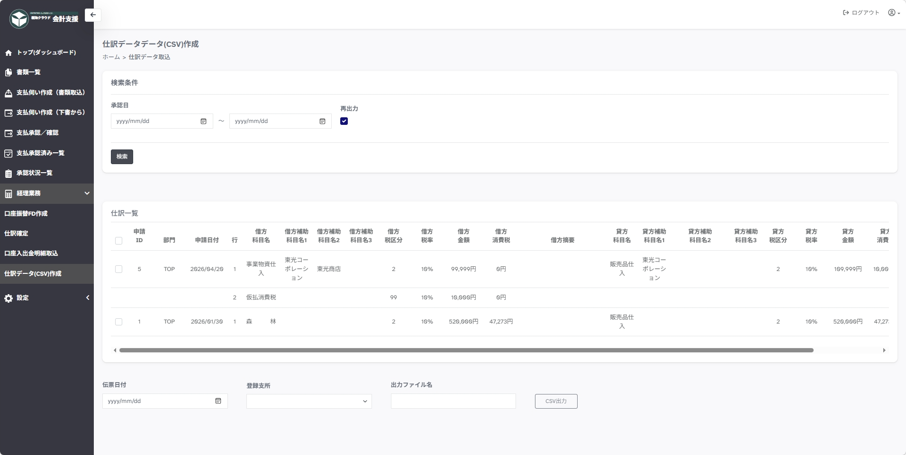
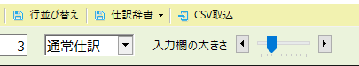

---
tags:
  - 連携
  - 経理業務
---

# 仕訳データ（ＣＳＶ）作成

`樹海GX 会計システム`へ取り込むためのCSVファイルの作成／ダウンロードを実施するページです。

サイドメニューの`経理業務＞仕訳データ（ＣＳＶ）作成`から移動します。
会計処理、会計管理者権限をもつユーザーのみがダウンロード可能です。

## 検索

最初に承認された日付の範囲で検索します。

## CSV出力

伝票日付と登録支所、出力ファイル名を指定します。
`CSV出力`ボタンからCSVファイルをダウンロードします。

!!! note "樹海GXの取込みについて"

    **樹海GX会計のCSV取込オプションを導入している方が対象**
    樹海GXの会計メニューにある伝票入力の上部にある`CSV取込`から、出力したＣＳＶを取り込むことが可能です。
    伝票日付、支所は伝票入力画面側で指定済みの状態となります。
    
    